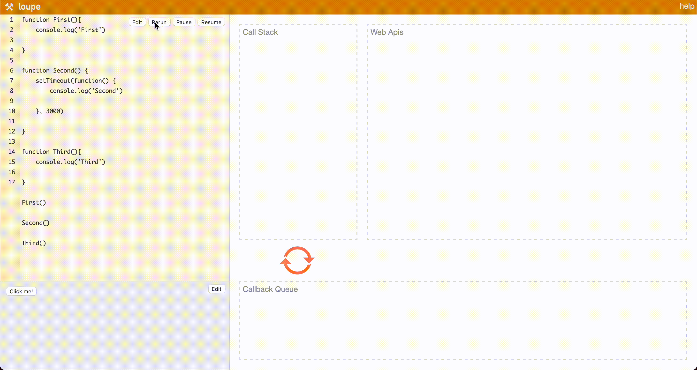

## Javascript Engine & Runtime


→ 자바스크립트는 단일 스레드 프로그래밍 언어이므로 단일 호출 스택이 존재한다.  
단일 호출 스택이 있다는 것은 한 번에 하나의 일만 처리할 수 있다는 뜻이고, 해당 스택은 LIFO 방식으로 처리된다.

<br />

## Callback & Promises
```js
// 익명의 함수를 사용하는 콜백함수 예제
let temp = [1, 2, 3, 4, 5]
temp.forEach(x => console.log(x * 2)

// 함수의 이름과 값을 넘기는 콜백 함수
function deSomething(number, callback) {
    callback(number * number)
}

function getSomething(result){
    console.log(`결과 값: ${result}`)   // 결과 값: 5
}

doSomething(5, getSomething)
```

**콜백함수란**,  
1. 다른 함수의 인자로써 이용되는 함수
2. 어떤 이벤트에 의해 호출되는 함수로써 특정한 문법을 가지고 있는 것이 아닌, 호출방식에 의한 구분이다.

자바스크립트에서 전통적인 비동기적 처리 로직을 수행 할 수 있는 방법이지만, 콜백 함수를 연속적으로 사용할 경우
가독성이 떨어지고 로직 변경이 어려운 콜백 헬(Callback Hell)이 발생하여 에러 처리가 더욱더 곤란한 상황이 발생하는데

이러한 문제를 극복하기 위해 `Promise`가 제안되었고 이는 ES6 버전에 정식 채택되어 IE를 제외한 대부분의 브라우저에서 지원한다.

<br />

```js
function EvenOrOdd(number ){
    return new Promise((resolve, reject) => {
        // Pending(대기)
        if(number % 2 === 0){
            // Fulfilled(이행)
            resolve('Even Number')
        } else {
            // Reject(실패)
            reject('Odd Number')
        }
    })
}

EvenOrOdd(5)
    .then(resolve => console.log(resolve))
    .catch(err => console.log(err))
```

`Promise 객체`는 앞서 Callback 문제인 가독성과 오류 처리 등의 문제를 해결하기 위해 ES6 버전에 정식 채택되었다.

위와 같이 new Promise() 메소드를 통해 콜백함수로 선언한 뒤, 동작에 대한 결과 따라 resolve, reject 함수를 호출한다.
이후, Promise는 3가지 상태를 가지는데 then()를 통해 처리 결과 값과 catch()를 함께 사용하여 실패한 이유 또는 오류를 받을 수 있다.

→ 위 함수와 같이 함수의 처리 순서에 따라 callback을 작성할 수 있어 유지보수에 적합하고, 각 상황에 따라 다른 함수로 처리되게 할 수도 있다.


<br />

## async & await
```js
function process() {
    return new Promise((resolve, reject) => {
        setTimeout(() => {
            resolve('처리 완료')
        }, 2000)
    })
}

async function getProcess() {
    console.log('시작')     // 시작
    console.log(await process())        // (5초 후) 처리 완료
    console.log('종료')     // 종료
}

getProcess()
```

`async`과 `await`은 ES2017에(ES8) 추가된 기능으로, 비동기식 프로그램을 일반 동기 프로그램과 유사한 방식으로 구성할 수 있도록 하는 기능이다.
await 키워드는 async 함수 내에서만 사용할 수 있으며 await의 값은 항상 Promise 객체를 반환(하도록) 해야 한다.

→ process() 함수에서는 Fulfilled(이행) 상태의 Promise를 반환하고, getProcess() 함수의 앞에 async 키워드를 
process() 함수를 호출하는 앞 부분에 await 키워드를 붙여 동기적 로직 처리를 실행하도록 하여 순차적으로 실행되는 것을 확인할 수 있다.

<br />

## Blocking & Non-Blocking
**Blocking과 Non-Blocking은 제어점 관점에서 접근하는 방식이다.**

Node.js 표준 라이브러리는 두 종류의 I/O 메서드를 제공하며, 블로킹의 경우 `Sync`라는 suffix를 붙이고, 
`Non-Blocking`의 경우 callback 함수를 받는다.

```js
const fs = require('fs')
console.log('Start')
const data = fs.readFileSync('./text.txt', 'utf8')
console.log(data)
console.log('End')

/**
 * 출력 결과
 * 1. Start
 * 2. Reading File
 * 3. Output File Context
 * 4. End
 */
```

위 코드는 readFileSync()라는 Blocking 함수를 이용한 예이다.

→ 따라서 순차적으로 코드가 실행되며 text.txt 파일을 모두 읽기 전까지는 data가 출력되지 않는다.

**블로킹을 사용하면 작업이 순차적으로 이루어져 작업 흐름을 쉽게 이해할 수 있다는 장점이 있지만,
작업이 완료될 때까지 제어권을 반환하지 않아 대기시간이 길어질 수 있다는 단점이 존재한다.**

<br />

```js
const fs = require('fs')
console.log('Start')
fs.readFile('./text.txt', 'utf8', (err, result) => {
    if(err) {
        throw err
    } else {
        console.log(result)
    }
})
console.log('End')

/**
 * 출력 결과
 * 1. Start
 * 2. End
 * 3. Reading File
 * 4. Output File Context
 */
```

위 코드는 readFile ()라는 Non-Blocking 함수를 이용한 예이다.

→ I/O 작업은 콜백을 통해 그 결과를 반환하고, 이 작업과 상관없이 console.log( )는 순차적으로 수행된다.

**Non-Blocking의 이점은 자바스크립트 코드가 아닌 I/O 처리 등의 작업이 일어나는 동안 동시에 처리할 수 있다는 점이고,
단점은 설계가 복잡해지거나 CPU가 처리해야 하는 작업이 많은 경우에는 적합하지 않다는 점이다.**
