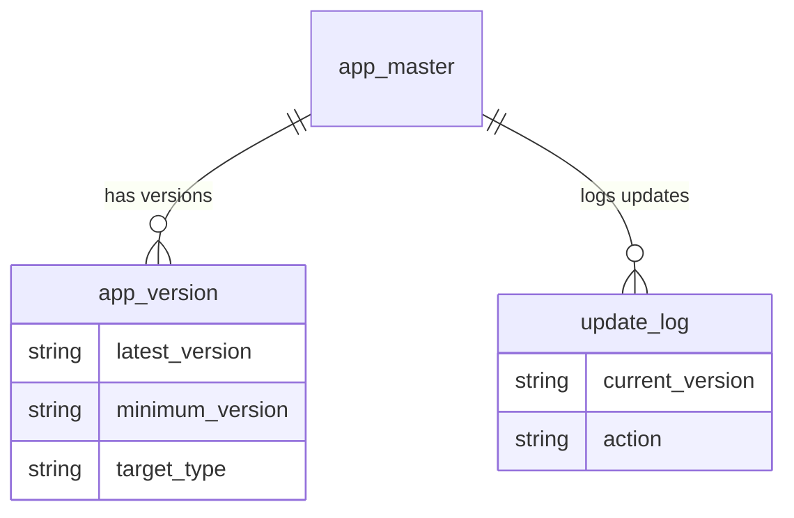
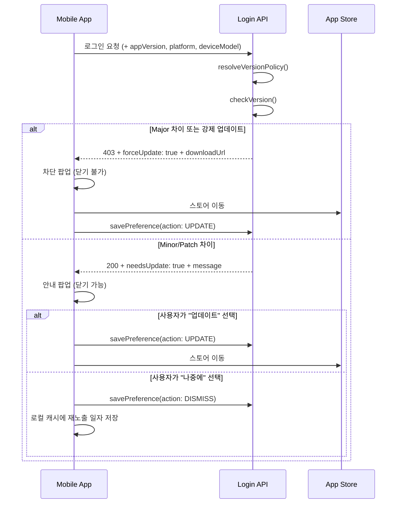

## 왜 강제 업데이트가 필요한가

모바일 앱을 운영하다 보면 "이 버전은 더 이상 쓰면 안 된다"는 상황이 반드시 온다. 인증 방식 변경, 주요 API 스펙 변경, 보안 취약점 패치 같은 경우다. 스토어 리뷰를 기다리는 동안 구버전 사용자가 장애를 겪는 건 피할 수 없지만, 최소한 신버전이 배포된 후에는 빠르게 유도할 수 있어야 한다.

나는 B2B SaaS 플랫폼의 모바일 앱에 Semver 기반 버전 체크를 구현했다. Major/Minor/Patch 각 세그먼트별로 다른 UX를 적용하고, 멀티테넌트 환경에서 테넌트별 예외 버전까지 관리하는 구조다. 로그인 API의 버전 체크 로직과 테이블 설계를 공유한다.

## 버전 체크 전략

Semver(Semantic Versioning)의 `Major.Minor.Patch` 세 자리를 각각 다르게 취급한다.

| 구분 | 동작 | UX |
|------|------|-----|
| **Major 불일치** | 로그인 차단 + 업데이트 강제 | 앱 사용 불가. 스토어로 이동하는 버튼만 노출 |
| **Minor 불일치** | 로그인 허용 + 안내 메시지 | "새 버전이 있습니다" 팝업. 닫기 가능 |
| **Patch 불일치** | 로그인 허용 + 안내 메시지 | Minor와 동일. 재노출 주기 설정 가능 |

핵심 설계 결정이 몇 가지 있었다.

**현재 버전이 서버 기준보다 높으면 무시한다.** 개발 빌드나 베타 테스트 상황에서 서버에 등록된 최신 버전보다 높은 버전이 설치되어 있을 수 있다. 이 경우 업데이트 안내를 띄우면 안 된다. 비교 로직에서 `current >= latest`이면 체크를 건너뛴다.

**구버전 앱은 버전 정보를 안 보낸다.** 이 기능이 도입되기 전에 배포된 앱은 요청에 버전 필드가 없다. 이런 클라이언트에 대해 강제 업데이트를 적용할 방법이 없으므로, 버전 필드가 없으면 체크 자체를 스킵한다. 결국 클라이언트 업데이트가 선행되어야 서버 측 강제 업데이트가 의미를 갖는다.

**메시지 재노출 주기는 클라이언트가 관리한다.** 서버는 "몇 일 후에 다시 보여줘"라는 값만 내려주고, 실제 캐싱과 재노출 판단은 앱 측에서 한다. 서버가 사용자별 노출 상태를 관리하면 복잡도가 기하급수적으로 늘어나기 때문이다.

## 테이블 설계

멀티테넌트 SaaS에서는 "전체 기본 버전"과 "특정 테넌트/디바이스 예외 버전"을 모두 관리해야 한다. 테이블 3개로 구성했다.

### app_master — 앱 식별 정보

플랫폼(Web/Mobile/Tablet)과 OS(iOS/Android)를 조합하여 앱을 식별한다. 테넌트별로 별도의 앱 마스터를 등록할 수 있어서, 같은 플랫폼이라도 테넌트마다 다른 다운로드 경로를 가질 수 있다.

```sql
CREATE TABLE app_master (
  id           VARCHAR(32) PRIMARY KEY,
  app_id       VARCHAR(32) NOT NULL,   -- 애플리케이션 ID
  tenant_id    VARCHAR(32) NOT NULL,   -- 테넌트 ID
  name         VARCHAR(50),
  description  VARCHAR(50),
  beta_flag    CHAR(1) DEFAULT '0',    -- 베타 앱 여부
  platform     VARCHAR(10),            -- Web / Mobile / Tablet / Desktop
  os_type      VARCHAR(10),            -- All / iOS / Android
  download_url VARCHAR(100),           -- 스토어 URL
  created_at   DATETIME,
  updated_at   DATETIME,
  INDEX idx_tenant_app (tenant_id, app_id)
);
```

여기서 `tenant_id`와 `app_id` 조합이 핵심이다. 테넌트가 직접 버전을 관리하지 않으면 상위 애플리케이션 레벨의 버전을 상속받는 구조다.

### app_version — 버전 정책

Standard(기본)와 Exception(예외) 두 가지 타입으로 나뉜다. Standard는 전체 사용자에게 적용되고, Exception은 특정 디바이스 모델이나 OS 버전에만 적용된다.

```sql
CREATE TABLE app_version (
  id               VARCHAR(32) PRIMARY KEY,
  app_id           VARCHAR(32) NOT NULL,
  tenant_id        VARCHAR(32) NOT NULL,
  master_id        VARCHAR(32),          -- app_master FK
  version_name     VARCHAR(50),
  target_type      VARCHAR(10),          -- Standard / Exception
  device_model     VARCHAR(50),          -- 특정 디바이스 (All이면 전체)
  os_version       VARCHAR(10),          -- 대상 OS 버전
  latest_version   VARCHAR(10) NOT NULL, -- 최신 버전 (예: 2.1.0)
  minimum_version  VARCHAR(10) NOT NULL, -- 최소 허용 버전 (예: 1.0.0)
  force_update     CHAR(1) DEFAULT '0',  -- 강제 업데이트 플래그
  update_message   VARCHAR(250),         -- 커스텀 메시지 (NULL이면 기본 메시지)
  show_message     CHAR(1) DEFAULT '1',  -- 메시지 노출 여부
  message_interval INT DEFAULT 0,        -- 재노출 주기 (일). 0이면 매번
  created_at       DATETIME,
  updated_at       DATETIME,
  INDEX idx_tenant_app (tenant_id, app_id),
  INDEX idx_master (master_id)
);
```

`latest_version`과 `minimum_version`의 관계가 중요하다.

- 클라이언트 버전이 `minimum_version`보다 낮으면 무조건 강제 업데이트
- `minimum_version` 이상 ~ `latest_version` 미만이면 Major/Minor/Patch 비교 후 차등 처리
- `latest_version` 이상이면 아무 조치 안 함

### update_log — 사용자 반응 추적

사용자가 업데이트 팝업에서 "업데이트" 또는 "나중에"를 클릭한 이력을 저장한다. 운영 관점에서 어떤 버전의 사용자가 업데이트를 거부하는지 집계할 때 유용하다.

```sql
CREATE TABLE update_log (
  id              VARCHAR(32) PRIMARY KEY,
  app_id          VARCHAR(32) NOT NULL,
  tenant_id       VARCHAR(32) NOT NULL,
  master_id       VARCHAR(32),          -- app_master FK
  user_id         VARCHAR(32) NOT NULL,
  device_model    VARCHAR(50),
  os_type         VARCHAR(30),
  os_version      VARCHAR(10),
  current_version VARCHAR(10) NOT NULL,  -- 설치된 버전
  latest_version  VARCHAR(10) NOT NULL,  -- 서버 기준 최신 버전
  action          VARCHAR(10) NOT NULL,  -- UPDATE / DISMISS
  client_ip       VARCHAR(20),
  created_at      DATETIME,
  INDEX idx_tenant_app (tenant_id, app_id),
  INDEX idx_master (master_id)
);
```

세 테이블의 관계를 정리하면 이렇다.



## 핵심 구현 로직

로그인 API에서 버전 체크를 수행하는 서버리스 함수의 핵심 로직이다. 실제 코드를 추상화한 의사코드로 정리했다.

### 1. Semver 파싱 및 비교

```typescript
interface SemVer {
  major: number;
  minor: number;
  patch: number;
}

function parseSemVer(version: string): SemVer {
  const [major, minor, patch] = version.split('.').map(Number);
  return { major, minor, patch };
}

type VersionDiff = 'major' | 'minor' | 'patch' | 'none';

function compareVersions(current: SemVer, latest: SemVer): VersionDiff {
  if (current.major < latest.major) return 'major';
  if (current.major > latest.major) return 'none'; // 현재가 더 높으면 무시
  if (current.minor < latest.minor) return 'minor';
  if (current.minor > latest.minor) return 'none';
  if (current.patch < latest.patch) return 'patch';
  return 'none';
}
```

`compareVersions`에서 현재 버전이 서버 기준보다 높은 경우 `'none'`을 반환하는 게 포인트다. Major가 같고 Minor가 더 높은 경우도 마찬가지로 체크를 건너뛴다.

### 2. 버전 정책 조회

클라이언트가 보내는 플랫폼 타입, 디바이스 모델, OS 버전 정보를 기반으로 적용할 버전 정책을 결정한다. Exception 타입이 있으면 우선 적용하고, 없으면 Standard로 폴백한다.

```typescript
async function resolveVersionPolicy(params: {
  appId: string;
  tenantId: string;
  platform: string;
  deviceModel: string;
  osVersion: string;
}): Promise<VersionPolicy | null> {
  // 1순위: Exception (특정 디바이스/OS 대상)
  const exception = await db.query(`
    SELECT * FROM app_version
    WHERE app_id = ? AND tenant_id = ?
      AND target_type = 'Exception'
      AND (device_model = ? OR device_model = 'All')
      AND (os_version = ? OR os_version IS NULL)
    ORDER BY device_model DESC  -- 구체적인 매칭 우선
    LIMIT 1
  `, [params.appId, params.tenantId, params.deviceModel, params.osVersion]);

  if (exception) return exception;

  // 2순위: Standard (전체 대상)
  const standard = await db.query(`
    SELECT * FROM app_version
    WHERE app_id = ? AND tenant_id = ?
      AND target_type = 'Standard'
    LIMIT 1
  `, [params.appId, params.tenantId]);

  return standard ?? null;
}
```

Exception을 먼저 조회하고 Standard로 폴백하는 2단계 조회가 핵심이다. 특정 삼성 태블릿에서만 이전 버전을 유지해야 하는 경우 같은 엣지 케이스를 이 구조로 처리한다.

### 3. 체크 결과 생성

```typescript
interface VersionCheckResult {
  needsUpdate: boolean;
  forceUpdate: boolean;
  diffLevel: VersionDiff;
  message: string | null;
  showMessage: boolean;
  messageInterval: number;
  downloadUrl: string | null;
}

function checkVersion(
  currentVersion: string,
  policy: VersionPolicy
): VersionCheckResult {
  const current = parseSemVer(currentVersion);
  const latest = parseSemVer(policy.latest_version);
  const minimum = parseSemVer(policy.minimum_version);
  const diff = compareVersions(current, latest);

  // 최신 버전 이상이면 업데이트 불필요
  if (diff === 'none') {
    return {
      needsUpdate: false,
      forceUpdate: false,
      diffLevel: 'none',
      message: null,
      showMessage: false,
      messageInterval: 0,
      downloadUrl: null,
    };
  }

  // 최소 버전 미만이면 무조건 강제 업데이트
  const belowMinimum =
    current.major < minimum.major ||
    (current.major === minimum.major && current.minor < minimum.minor) ||
    (current.major === minimum.major && current.minor === minimum.minor &&
     current.patch < minimum.patch);

  const forceUpdate = diff === 'major' || belowMinimum || policy.force_update === '1';

  return {
    needsUpdate: true,
    forceUpdate,
    diffLevel: diff,
    message: policy.update_message ?? getDefaultMessage(diff),
    showMessage: policy.show_message === '1',
    messageInterval: policy.message_interval,
    downloadUrl: policy.download_url,
  };
}

function getDefaultMessage(diff: VersionDiff): string {
  switch (diff) {
    case 'major':
      return '필수 업데이트가 있습니다. 계속 사용하려면 앱을 업데이트해주세요.';
    case 'minor':
    case 'patch':
      return '새 버전이 출시되었습니다. 업데이트하시겠습니까?';
    default:
      return '';
  }
}
```

`forceUpdate`가 `true`인 세 가지 경우를 정리하면 이렇다.

1. **Major 버전 차이** — 1.x.x에서 2.x.x로 올라간 경우
2. **최소 버전 미만** — 관리자가 설정한 `minimum_version`보다 낮은 경우
3. **강제 업데이트 플래그** — 관리자가 수동으로 강제 업데이트를 활성화한 경우

### 4. 사용자 반응 저장

클라이언트에서 사용자가 "업데이트" 또는 "나중에" 버튼을 눌렀을 때 별도 API로 이력을 저장한다. 로그인 API와 분리한 이유는, 강제 업데이트 팝업에서는 "나중에" 선택지가 없기 때문이다. Major 업데이트의 경우 사용자는 "업데이트" 또는 앱 종료만 할 수 있고, 이 두 가지 모두 추적한다.

```typescript
async function saveUpdatePreference(params: {
  appId: string;
  tenantId: string;
  masterId: string;
  userId: string;
  deviceModel: string;
  osType: string;
  osVersion: string;
  currentVersion: string;
  latestVersion: string;
  action: 'UPDATE' | 'DISMISS';
  clientIp: string;
}): Promise<void> {
  await db.execute(`
    INSERT INTO update_log
    (id, app_id, tenant_id, master_id, user_id,
     device_model, os_type, os_version,
     current_version, latest_version, action, client_ip, created_at)
    VALUES (?, ?, ?, ?, ?, ?, ?, ?, ?, ?, ?, ?, NOW())
  `, [
    generateId(),
    params.appId,
    params.tenantId,
    params.masterId,
    params.userId,
    params.deviceModel,
    params.osType,
    params.osVersion,
    params.currentVersion,
    params.latestVersion,
    params.action,
    params.clientIp,
  ]);
}
```

## 클라이언트 연동 흐름

서버 구현만큼 중요한 게 클라이언트 측 처리다. 전체 흐름을 시퀀스로 정리하면 이렇다.



클라이언트에서 주의할 점 몇 가지를 덧붙이면.

**캐시 기반 재노출 관리.** 서버가 `messageInterval: 3`을 내려주면, 클라이언트는 "나중에"를 누른 시점으로부터 3일 후에 다시 팝업을 보여준다. 이 값을 SharedPreferences(Android)나 UserDefaults(iOS)에 저장한다. 서버에서 관리하면 매 로그인마다 상태를 조회해야 하니 클라이언트 캐시가 훨씬 경제적이다.

**버전 필드 누락 처리.** 이 기능이 도입되기 전에 배포된 앱은 로그인 요청에 버전 필드를 보내지 않는다. 서버는 버전 필드가 없으면 체크를 스킵하고 정상 로그인으로 처리한다. 이런 구버전 앱에 강제 업데이트를 적용할 방법은 없으므로, 스토어 공지나 인앱 메시지 같은 별도 채널을 활용해야 한다.

## 테스트 시나리오

실제 QA에서 검증한 시나리오를 정리했다. iOS/Android 양쪽에서 모두 확인해야 한다.

### iOS 테스트 (현재 버전: 1.0.0 기준)

| 시나리오 | 타입 | 서버 최신 버전 | 서버 최소 버전 | 기대 결과 |
|---------|------|-------------|-------------|----------|
| 기본 버전 체크 | Standard | 1.1.0 | 1.0.0 | Minor 안내 팝업 |
| 현재가 더 높음 | Exception | 0.9.0 | 0.8.0 | 체크 스킵 (정상 로그인) |
| 최소 미만 | Exception | 1.2.0 | 1.1.0 | 강제 업데이트 |
| Major 차이 | Exception | 2.0.0 | 1.0.0 | 강제 업데이트 |
| Minor 차이 | Exception | 1.1.0 | 1.0.0 | 안내 팝업 |
| Patch 차이 | Exception | 1.0.5 | 1.0.0 | 안내 팝업 |

### Android 테스트 (현재 버전: 1.1.1 기준)

| 시나리오 | 타입 | 서버 최신 버전 | 서버 최소 버전 | 강제 업데이트 | 메시지 노출 | 기대 결과 |
|---------|------|-------------|-------------|------------|-----------|----------|
| 기본 버전 체크 | Standard | 2.0.0 | 1.1.0 | Yes | Yes | 강제 업데이트 |
| 현재가 더 높음 | Exception | 1.0.0 | 0.9.0 | No | Yes | 체크 스킵 |
| 최소 미만 | Exception | 1.3.0 | 1.2.0 | No | No | 강제 업데이트 |
| 강제 플래그 ON | Exception | 1.2.0 | 1.1.0 | Yes | No | 강제 업데이트 |
| Major 차이 | Exception | 2.0.0 | 1.0.0 | No | No | 강제 업데이트 |
| Minor 차이 | Exception | 1.2.0 | 1.1.0 | No | No | 안내 팝업 |
| Patch 차이 | Exception | 1.1.5 | 1.1.0 | No | No | 안내 팝업 |

테스트에서 발견된 수정 사항 두 가지가 있었다.

1. **현재 > 최신 예외 처리 누락.** 초기 구현에서는 `current >= latest` 체크가 없어서 개발 빌드에서 불필요한 팝업이 떴다. `compareVersions` 함수에서 각 세그먼트별로 현재가 더 큰 경우 `'none'`을 반환하도록 수정했다.
2. **플랫폼 타입 조건 누락.** 버전 조회 쿼리에 플랫폼 타입 조건이 빠져서 Web 기준 버전이 Mobile에 적용되는 버그가 있었다. `WHERE` 절에 `platform = ?`을 추가하여 해결했다.

## 운영 팁

이 구조를 운영하면서 알게 된 것들.

**다국어 메시지는 클라이언트가 관리한다.** 서버에서 `update_message`를 내려주는 건 기본 메시지 오버라이드 용도다. 다국어 대응은 클라이언트의 i18n 리소스를 쓰고, 서버는 메시지 키(`MSG_UPDATE_REQUIRED` 같은)를 내려주는 방식이 더 유연하다. 다만 특정 테넌트가 자사 브랜드 문구를 쓰고 싶어하면 `update_message`에 직접 넣어준다.

**로그인 이력에 버전 정보를 추가한다.** 기존 로그인 이력 테이블에 `sdk_version`과 `master_id` 컬럼을 추가하면, 별도 대시보드 없이도 "현재 어떤 버전 사용자가 몇 명인지" 기존 로그 분석 도구로 바로 확인할 수 있다.

**update_log의 DISMISS 비율을 모니터링한다.** 특정 버전에서 DISMISS 비율이 높으면 해당 버전의 사용자 경험에 문제가 있을 수 있다. 업데이트 안내 메시지를 더 구체적으로 바꾸거나, `messageInterval`을 줄여서 재노출 빈도를 높이는 식으로 대응한다.

## 결론

Semver 기반 모바일 앱 버전 관리의 핵심은 세 가지다.

1. **Major는 차단, Minor/Patch는 안내.** 이 한 줄이 전체 설계의 출발점이다.
2. **Standard/Exception 이원 구조.** 멀티테넌트 환경에서 전체 정책과 디바이스별 예외를 분리 관리한다.
3. **사용자 반응 추적.** 강제 업데이트가 아닌 경우 사용자의 선택을 기록하여 운영 인사이트를 확보한다.

이 패턴은 B2B 플랫폼뿐 아니라 일반 모바일 앱에서도 그대로 쓸 수 있다. `app_master`의 테넌트 개념만 빼면 훨씬 단순해진다. 중요한 건 Semver의 세 세그먼트에 명확한 의미를 부여하고, 서버와 클라이언트의 책임을 깔끔하게 나누는 것이다.

## 참고 링크

- [Semantic Versioning 2.0.0](https://semver.org/) — Semver 공식 스펙
- [Google Play 인앱 업데이트 가이드](https://developer.android.com/guide/playcore/in-app-updates) — Android 공식 인앱 업데이트 API
- [App Store 버전 관리 모범 사례](https://developer.apple.com/documentation/bundleresources/information-property-list/cfbundleshortversionstring) — Apple의 버전 문자열 가이드
- [node-semver](https://github.com/npm/node-semver) — npm의 Semver 파싱/비교 라이브러리 (서버 측 구현 참고)
- [Mobile App Update Strategies](https://martinfowler.com/articles/mobile-ci-cd.html) — Martin Fowler의 모바일 CI/CD 패턴
