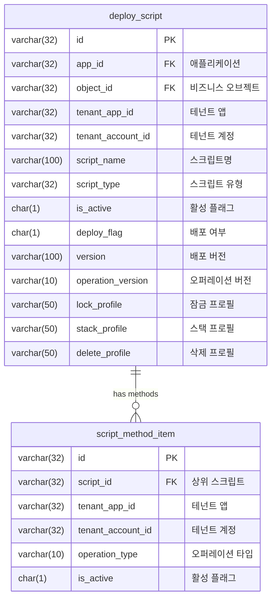

## 배경: 전체 배포의 불편함

사내 로우코드 플랫폼의 배포 도구를 운영하다 보면, 서버 사이드 스크립트를 배포할 때 **전체 메서드를 일괄 배포**해야 하는 상황이 자주 발생한다. Pre/Post 훅 스크립트에 Select, Save, Delete 같은 여러 Operation이 있는데, 하나만 수정했어도 전부 다시 배포해야 했다.

이런 방식은 몇 가지 문제를 만든다.

- **불필요한 배포 범위**: 변경하지 않은 메서드까지 재배포되어 사이드 이펙트 우려
- **배포 시간 증가**: 전체 스크립트를 처리하므로 Lambda 실행 시간이 길어짐
- **운영 리스크**: 의도하지 않은 메서드가 덮어씌워질 가능성

이 글에서는 VSCode Extension에서 **배포할 메서드를 선택적으로 고를 수 있는 UI**를 만들고, Lambda 함수에서 선택된 메서드만 처리하도록 구현한 과정을 정리한다.

---

## 아키텍처 개요

전체 흐름은 크게 세 단계로 나뉜다.

```
VSCode Extension (QuickPick UI)
        │
        ▼  선택된 메서드 목록 전달
  Lambda Function (배포 처리)
        │
        ▼  선택된 메서드만 DB에 기록
  Runtime (스크립트 실행 시 등록된 메서드만 수행)
```

### 배포 가능한 메서드 단위

| Script 타입 | Operation |
|---|---|
| PreScript | Select, Save, Delete |
| PostScript | Select, Save, Delete |

총 6개의 메서드를 개별적으로 선택/해제할 수 있다.

---

## VSCode Extension UI 구현

### QuickPick으로 멀티 선택 UI 만들기

VSCode Extension API의 `window.showQuickPick`은 `canPickMany: true` 옵션으로 체크박스 형태의 멀티 선택 UI를 제공한다. 이를 활용하면 배포할 메서드를 직관적으로 고를 수 있다.

```typescript
const deployOptions = [
  'PreScript-Select',
  'PreScript-Save',
  'PreScript-Delete',
  'PostScript-Select',
  'PostScript-Save',
  'PostScript-Delete',
];

const selected = await vscode.window.showQuickPick(deployOptions, {
  canPickMany: true,
  placeHolder: 'Please select deploy method',
});

if (!selected || selected.length === 0) {
  vscode.window.showErrorMessage('배포할 메서드를 하나 이상 선택해주세요.');
  return;
}
```

여기서 핵심은 `canPickMany: true`다. 이 옵션 하나로 단일 선택 드롭다운이 체크박스 리스트로 바뀐다.

### 프로젝트 타입에 따른 분기

모든 배포 대상이 메서드 선택이 필요한 것은 아니다. 서버 스크립트 프로젝트일 때만 QuickPick을 띄우고, 그 외에는 기존의 커밋 메시지 입력 방식을 유지했다.

```typescript
let deployInput: string[] | string | undefined;

switch (item.type) {
  case 'SERVER_SCRIPT_PROJECT':
    deployInput = await vscode.window.showQuickPick(deployOptions, {
      canPickMany: true,
      placeHolder: 'Please select deploy method',
    });
    break;
  default:
    deployInput = await vscode.window.showInputBox({
      placeHolder: 'Please input deploy message',
    });
    break;
}
```

### 이전 배포 상태 자동 복원

사용자 경험을 위해 한 가지 더 고려한 점이 있다. **이전에 배포한 메서드를 QuickPick에서 자동으로 체크된 상태로 표시**하는 것이다.

Lambda에 이전 배포 항목을 조회하는 API를 추가하고, 응답을 QuickPick의 `picked` 속성에 매핑했다.

```typescript
// 이전 배포 항목 조회
const prevItems = await lambdaProvider.getPrevDeployItems(objectId);
// 예: [{ item: "PreScript-Select" }, { item: "PreScript-Save" }]

const quickPickItems: vscode.QuickPickItem[] = deployOptions.map((option) => ({
  label: option,
  picked: prevItems.some((prev) => prev.item === option),
}));

const selected = await vscode.window.showQuickPick(quickPickItems, {
  canPickMany: true,
  placeHolder: 'Please select deploy method',
});
```

이렇게 하면 처음 배포하는 프로젝트는 전체 선택 상태, 기존에 일부만 배포했던 프로젝트는 해당 메서드만 체크된 상태로 표시된다.

---

## Lambda 호출: 선택 정보 전달

Extension에서 선택된 메서드 목록을 Lambda에 전달할 때는 기존 배포 파라미터에 `deployMethod` 필드를 추가했다.

```typescript
interface DeployMethodItem {
  label: string;       // e.g. "preSelect"
  description: string; // e.g. "PreScript-Select"
  picked: boolean;
}

async function deploy(
  objectId: string,
  objectName: string,
  applicationId: string,
  sdkVersion: string,
  deployMethod?: DeployMethodItem[]
): Promise<boolean> {
  const payload = {
    funcName: 'deploy',
    objectId,
    objectName,
    applicationId,
    version: sdkVersion,
    deployMethod,   // 선택된 메서드 배열
  };

  const response = await callLambda('DeployServiceLambda', JSON.stringify(payload));
  return response.success;
}
```

`deployMethod`가 `undefined`이면 기존 전체 배포와 동일하게 동작하도록 하위 호환성을 유지했다.

---

## Lambda 측 처리 로직

Lambda에서는 수신한 `deployMethod`를 기반으로 DB에 메서드 단위 레코드를 관리한다.

### 신규 스크립트 배포

처음 배포하는 스크립트라면 스크립트 마스터 레코드와 함께 선택된 메서드 아이템을 INSERT한다.

```typescript
// 의사코드
if (existingScript.length === 0) {
  // 스크립트 마스터 레코드 생성
  await dao.insertServerScript(params);
  // 선택된 메서드별 아이템 레코드 생성
  await dao.insertScriptMethodItem(params);
}
```

### 기존 스크립트 재배포

이미 배포된 스크립트라면, 수정본(X 테이블) 존재 여부에 따라 INSERT 또는 UPDATE를 분기한다.

```typescript
// 의사코드
if (!existingDraft) {
  // 수정본이 없으면 새로 생성
  await dao.insertServerScriptDraft(params);
  await dao.insertScriptMethodItemDraft(params);
} else {
  // 수정본이 있으면 업데이트
  await dao.updateServerScriptDraft(params);
  await dao.updateScriptMethodItemDraft(params);
}
```

### 이전 배포 항목 조회 API

Extension의 QuickPick에 자동 선택 상태를 제공하기 위한 조회 서비스도 추가했다.

```typescript
async function getPrevDeployItems(objectId: string, accountId: string) {
  const items = await dao.selectPrevDeployItems({
    objectId,
    accountId,
  });
  // 응답: [{ item: "PreScript-Select" }, { item: "PreScript-Save" }]
  return items;
}
```

---

## 테이블 설계

메서드 단위 배포를 지원하려면 기존 스크립트 테이블과 1:N 관계인 **메서드 아이템 테이블**이 필요하다.

### ERD



### deploy_script (서버 스크립트 마스터)

스크립트 단위의 메타정보와 배포 상태를 관리한다.

```sql
CREATE TABLE deploy_script (
  id               VARCHAR(32)  NOT NULL PRIMARY KEY,
  app_id           VARCHAR(32)  DEFAULT NULL COMMENT '애플리케이션 ID',
  object_id        VARCHAR(32)  DEFAULT NULL COMMENT '비즈니스 오브젝트 ID',
  tenant_app_id    VARCHAR(32)  DEFAULT NULL COMMENT '테넌트 앱 ID',
  tenant_account_id VARCHAR(32) DEFAULT NULL COMMENT '테넌트 계정 ID',
  is_active        CHAR(1)      DEFAULT NULL COMMENT '활성 플래그',
  script_name      VARCHAR(100) DEFAULT NULL COMMENT '스크립트 이름',
  script_type      VARCHAR(32)  DEFAULT NULL COMMENT '스크립트 유형',
  lock_profile     VARCHAR(50)  DEFAULT NULL COMMENT '잠금 프로필 (편집 잠금)',
  deploy_flag      CHAR(1)      DEFAULT NULL COMMENT '배포 여부',
  version          VARCHAR(100) DEFAULT NULL COMMENT '배포 버전',
  operation_version VARCHAR(10) DEFAULT NULL COMMENT '오퍼레이션 버전',
  stack_profile    VARCHAR(50)  DEFAULT NULL COMMENT '스택 프로필',
  delete_profile   VARCHAR(50)  DEFAULT NULL COMMENT '삭제 프로필',
  created_by       VARCHAR(32)  DEFAULT NULL,
  modified_by      VARCHAR(32)  DEFAULT NULL,
  created_at       DATETIME     DEFAULT NULL,
  updated_at       DATETIME     DEFAULT NULL
) ENGINE=InnoDB DEFAULT CHARSET=utf8mb3;
```

| 주요 컬럼 | 설명 |
|---|---|
| `object_id` | 배포 대상 비즈니스 오브젝트 식별자 |
| `tenant_app_id` / `tenant_account_id` | 멀티테넌트 환경에서 앱·계정 식별 |
| `lock_profile` | 다른 개발자의 동시 편집을 방지하는 잠금 프로필 |
| `deploy_flag` | 배포 완료 여부 (`Y`/`N`) |
| `version` | 배포 시점의 버전 문자열 |

### script_method_item (메서드 단위 배포 아이템)

상위 스크립트에 속하는 개별 메서드(Pre/PostScript × Select/Save/Delete)의 배포 선택 정보를 저장한다.

```sql
CREATE TABLE script_method_item (
  id               VARCHAR(32)  NOT NULL PRIMARY KEY,
  script_id        VARCHAR(32)  DEFAULT NULL COMMENT '상위 스크립트 FK',
  tenant_app_id    VARCHAR(32)  NOT NULL COMMENT '테넌트 앱 ID',
  tenant_account_id VARCHAR(32) NOT NULL COMMENT '테넌트 계정 ID',
  operation_type   VARCHAR(10)  DEFAULT NULL COMMENT '오퍼레이션 타입',
  is_active        CHAR(1)      DEFAULT NULL COMMENT '활성 플래그',
  created_by       VARCHAR(32)  DEFAULT NULL,
  modified_by      VARCHAR(32)  DEFAULT NULL,
  created_at       DATETIME     DEFAULT NULL,
  updated_at       DATETIME     DEFAULT NULL,
  KEY idx_tenant   (tenant_account_id, tenant_app_id),
  KEY idx_script   (script_id)
) ENGINE=InnoDB DEFAULT CHARSET=utf8mb4;
```

| 주요 컬럼 | 설명 |
|---|---|
| `script_id` | 상위 `deploy_script` 테이블의 FK |
| `tenant_app_id` / `tenant_account_id` | 멀티테넌트 식별 (복합 인덱스) |
| `operation_type` | `preSave`, `preSelect`, `preDelete`, `postSave`, `postSelect`, `postDelete` 중 하나 |
| `is_active` | 소프트 삭제 플래그 |

### 버전 관리 테이블

운영 환경에서는 배포 버전 관리를 위해 **수정본(Draft) 테이블**을 별도로 운영한다. `deploy_script`와 `script_method_item` 각각에 대응하는 Draft 테이블(`_x` suffix)이 존재하며, 원본과 동일한 구조에 버전 관련 컬럼이 추가된 형태다.

| 추가 컬럼 | 설명 |
|---|---|
| `deploy_status` | 배포 상태 (draft, published 등) |
| `deploy_version` | 배포 버전 문자열 |
| `master_flag` | 마스터 레코드 여부 |
| `prev_version` | 이전 버전 번호 |
| `pub_version` | 게시 버전 번호 |

이 구조 덕분에 배포 이력 추적과 롤백이 가능하다.

---

## 런타임 실행 로직

배포가 완료된 후 실제 스크립트가 실행될 때는 `script_method_item` 테이블을 조회하여 **등록된 메서드만 실행**한다.

```typescript
// 의사코드: 런타임에서 스크립트 실행 시
const registeredMethods = await getScriptMethodItems(scriptId);

if (registeredMethods.length === 0) {
  // 아이템이 없으면 전체 Pre/PostScript 실행 (하위 호환)
  await executeAllMethods(script);
} else {
  // 등록된 메서드만 필터링하여 실행
  const currentOperation = getCurrentOperation(); // e.g. "preSave"
  if (registeredMethods.includes(currentOperation)) {
    await executeMethod(script, currentOperation);
  }
  // 미등록 메서드는 스킵
}
```

이 로직의 핵심은 **하위 호환성**이다. 메서드 아이템이 하나도 없으면 기존처럼 전체 스크립트를 실행하므로, 기능 도입 전에 배포된 스크립트에는 영향이 없다.

---

## 테스트 전략

### Extension 테스트

| 시나리오 | 기대 결과 |
|---|---|
| 기존 배포 아이템 없음 | 전체 6개 메서드 선택 상태로 표시 |
| 기존 배포 아이템 존재 | 해당 메서드만 자동 선택(picked) |
| 선택 없이 확인 클릭 | 에러 메시지 표시, 배포 중단 |

### Lambda 테스트

| 시나리오 | 기대 결과 |
|---|---|
| 신규 스크립트 배포 | 마스터 + 메서드 아이템 INSERT |
| 스크립트 삭제 | 메서드 아이템까지 전체 삭제 |
| 체크인(재배포) | 선택 메서드 아이템 갱신 |

### 런타임 테스트

| 시나리오 | 기대 결과 |
|---|---|
| 메서드 아이템 미존재 | 기존 로직 동일 수행 (전체 실행) |
| 아이템 존재 + 매칭 | 해당 스크립트만 수행 |
| 아이템 존재 + 불일치 | 스크립트 미수행 |

---

## 마무리

이 기능을 도입한 후 체감되는 변화는 다음과 같다.

- **배포 범위 최소화**: 변경한 메서드만 골라서 배포하니 사이드 이펙트 걱정이 줄었다
- **배포 속도 개선**: 불필요한 메서드 처리가 빠지면서 Lambda 실행 시간이 단축되었다
- **이전 상태 복원**: QuickPick에서 이전 배포 상태를 자동으로 보여주니 실수로 빠뜨리는 일이 없다

VSCode Extension API의 `showQuickPick`은 간단하지만 강력하다. `canPickMany`, `picked` 같은 옵션만으로도 꽤 실용적인 선택 UI를 만들 수 있다. Lambda와 조합하면 서버리스 환경에서도 세밀한 배포 제어가 가능하다.

---

## 참고 링크

- [VSCode Extension API - QuickPick](https://code.visualstudio.com/api/references/vscode-api#window.showQuickPick){:target="_blank"}
- [VSCode Extension API - QuickPickItem](https://code.visualstudio.com/api/references/vscode-api#QuickPickItem){:target="_blank"}
- [VSCode Extension API - withProgress](https://code.visualstudio.com/api/references/vscode-api#window.withProgress){:target="_blank"}
- [AWS Lambda - Invoke](https://docs.aws.amazon.com/lambda/latest/api/API_Invoke.html){:target="_blank"}
- [Your First Extension - VSCode Docs](https://code.visualstudio.com/api/get-started/your-first-extension){:target="_blank"}
