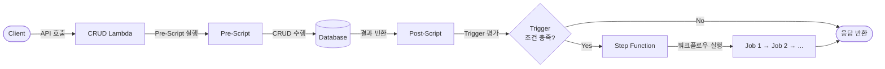
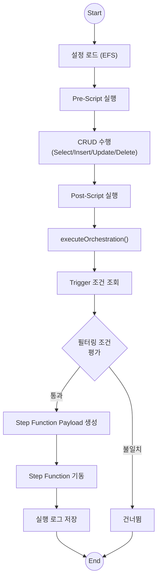
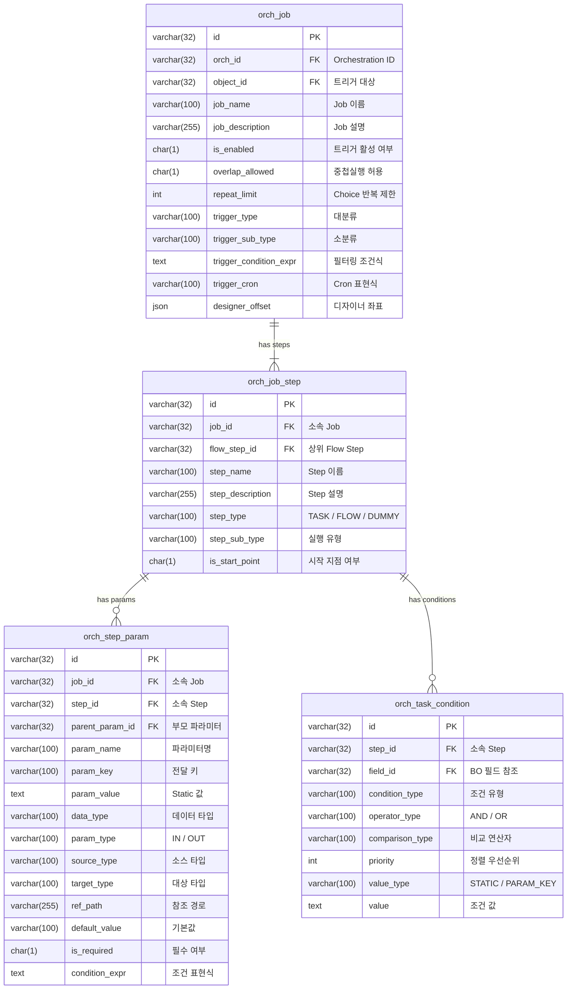

## 들어가며

엔터프라이즈 플랫폼을 운영하다 보면 CRUD 처리 이후 후행 작업을 자동으로 실행해야 하는 상황이 빈번하게 발생한다. 예를 들어 사용자가 주문 데이터를 저장하면 재고 차감, 알림 발송, 통계 집계 등 여러 후속 프로세스가 연쇄적으로 돌아가야 한다.

이 글에서는 AWS Step Functions를 활용하여 **이벤트 기반 Service Orchestration** 시스템을 설계하고 구현한 경험을 공유한다. Trigger 조건에 따라 Lambda 실행 후 Step Function 워크플로우를 자동으로 기동하는 구조를 다루며, 실제 운영 환경에서 적용할 수 있는 패턴에 초점을 맞추었다.

---

## 문제 정의

기존 시스템에서는 CRUD 작업과 후행 프로세스가 강하게 결합되어 있었다. 새로운 후행 작업을 추가하려면 Lambda 코드를 직접 수정하고 배포해야 했으며, 이는 다음과 같은 문제를 일으켰다.

- **강결합**: 비즈니스 로직 변경 시 관련 Lambda를 모두 수정해야 함
- **재사용 불가**: 동일한 후행 프로세스를 여러 트리거에서 사용하려면 코드 중복 발생
- **운영 부담**: 트리거 조건 변경마다 코드 배포 필요
- **모니터링 부재**: 후행 작업의 실행 상태를 추적하기 어려움

이 문제를 해결하기 위해 **설정 기반의 이벤트 기반 오케스트레이션** 시스템을 설계했다. 트리거 조건과 후행 작업을 DB에 등록하면, 코드 변경 없이 오케스트레이션 흐름을 제어할 수 있도록 하는 것이 목표였다.

---

## 아키텍처 설계

### 전체 흐름

시스템의 핵심 아이디어는 간단하다. **Lambda가 CRUD를 수행한 직후, 등록된 Trigger 조건을 평가하고 조건이 충족되면 Step Function을 기동**하는 것이다.



### Lambda 실행 흐름 상세

모든 CRUD Lambda는 공통 프레임워크(Base Service)를 상속받아 동일한 실행 흐름을 따른다. 핵심은 `executeOrchestration` 단계가 Post-Script 이후에 자동으로 호출된다는 점이다.



### Trigger Type 분류

다양한 이벤트 소스에 대응하기 위해 Trigger를 5가지 타입으로 분류했다.

| Trigger Type | 설명 | Sub Type 예시 |
|---|---|---|
| **Component** | UI 컴포넌트 이벤트 기반 | Select, Insert, Update, Delete |
| **BizObject** | 비즈니스 오브젝트 이벤트 기반 | Select, Insert, Update, Delete |
| **Platform** | 외부 API / Interface 기반 | REST API, Procedure, CRUD |
| **Automation** | 시스템 관리 이벤트 기반 | CreateUser, EditUser, Login 등 |
| **Schedule** | 스케줄 기반 (Cron) | - |

Component와 BizObject는 내부 CRUD 이벤트에 반응하고, Platform은 외부 시스템 연동 시 트리거되며, Automation은 사용자 관리나 인증 같은 시스템 이벤트에 대응한다. Schedule은 별도의 Cron 표현식으로 주기적 실행을 지원한다.

---

## 테이블 설계

오케스트레이션 워크플로우를 코드가 아닌 DB에서 선언적으로 관리하기 위해 4개의 핵심 테이블을 설계했다. Job이 트리거 조건과 실행 워크플로우를 모두 포함하는 구조다.

### ER Diagram



### orch_job (오케스트레이션 Job)

워크플로우의 최상위 단위로, **트리거 조건과 실행 정의를 하나의 레코드에 통합**한다. 어떤 오브젝트에 어떤 타입의 이벤트가 발생했을 때 실행할지를 선언적으로 정의한다.

```sql
CREATE TABLE orch_job (
  id                    VARCHAR(32)  NOT NULL PRIMARY KEY,
  orch_id               VARCHAR(32)  DEFAULT NULL COMMENT 'Orchestration ID',
  object_id             VARCHAR(32)  DEFAULT NULL COMMENT '트리거 대상 오브젝트 ID',
  job_name              VARCHAR(100) DEFAULT NULL COMMENT 'Job 이름',
  job_description       VARCHAR(255) DEFAULT NULL COMMENT 'Job 설명',
  is_enabled            CHAR(1)      DEFAULT NULL COMMENT '트리거 활성 여부 (Y/N)',
  overlap_allowed       CHAR(1)      DEFAULT NULL COMMENT '중첩실행 허용 플래그',
  repeat_limit          INT          DEFAULT NULL COMMENT 'Choice Step 반복 실행 제한 횟수',
  trigger_type          VARCHAR(100) DEFAULT NULL COMMENT '트리거 대분류 (Component|BizObject|Platform|Automation|Schedule)',
  trigger_sub_type      VARCHAR(100) DEFAULT NULL COMMENT '트리거 소분류 (Select|Insert|Update|Delete|Login|...)',
  trigger_condition_expr TEXT        DEFAULT NULL COMMENT '트리거 필터링 조건식 (JSON)',
  trigger_cron          VARCHAR(100) DEFAULT NULL COMMENT 'Schedule 타입 Cron 표현식',
  trigger_cron_desc     VARCHAR(255) DEFAULT NULL COMMENT 'Cron 설명',
  designer_offset       JSON         DEFAULT NULL COMMENT 'Orchestration Designer UI 좌표',
  -- 멀티테넌트 & 시스템 필드
  tenant_app_id         VARCHAR(32)  DEFAULT NULL,
  tenant_account_id     VARCHAR(32)  DEFAULT NULL,
  is_active             CHAR(1)      DEFAULT NULL,
  created_by            VARCHAR(32)  DEFAULT NULL,
  modified_by           VARCHAR(32)  DEFAULT NULL,
  created_at            DATETIME     DEFAULT NULL,
  updated_at            DATETIME     DEFAULT NULL
) ENGINE=InnoDB DEFAULT CHARSET=utf8mb4;
```

| 주요 컬럼 | 설명 |
|---|---|
| `object_id` | 트리거 감시 대상 오브젝트. CRUD Lambda 실행 시 이 ID로 등록된 Job을 조회 |
| `trigger_type` / `trigger_sub_type` | 대분류(Component, BizObject 등) + 소분류(Select, Insert 등)로 트리거 조건을 세분화 |
| `trigger_condition_expr` | JSON 형태의 필터링 규칙 배열. 문자열 비교, 커스텀 표현식 등을 조합 |
| `trigger_cron` | Schedule 타입일 때만 사용. `0 9 * * MON` 같은 Cron 표현식 |
| `overlap_allowed` | 이전 실행이 완료되기 전에 동일 Job을 중복 기동할 수 있는지 여부 |
| `repeat_limit` | Choice Step에서 조건 반복 실행 최대 횟수 (무한 루프 방지) |
| `designer_offset` | 시각적 워크플로우 디자이너에서의 노드 좌표 정보 (JSON) |

### orch_job_step (Job Step)

하나의 Job은 여러 Step으로 구성된다. Step은 실제 실행 단위(TASK)이거나 흐름 제어 단위(FLOW)이며, FLOW 내부에 하위 Step을 재귀적으로 포함할 수 있다.

```sql
CREATE TABLE orch_job_step (
  id                VARCHAR(32)  NOT NULL PRIMARY KEY,
  job_id            VARCHAR(32)  DEFAULT NULL COMMENT '소속 Job FK',
  flow_step_id      VARCHAR(32)  DEFAULT NULL COMMENT '상위 Flow Step FK (FLOW 내부 Step일 때)',
  step_name         VARCHAR(100) DEFAULT NULL COMMENT 'Step 이름',
  step_description  VARCHAR(255) DEFAULT NULL COMMENT 'Step 설명',
  step_type         VARCHAR(100) DEFAULT NULL COMMENT 'TASK | FLOW | DUMMY',
  step_sub_type     VARCHAR(100) DEFAULT NULL COMMENT '실행 유형 상세',
  is_start_point    CHAR(1)      DEFAULT NULL COMMENT '워크플로우 시작 지점 여부',
  -- 멀티테넌트 & 시스템 필드
  tenant_app_id     VARCHAR(32)  DEFAULT NULL,
  tenant_account_id VARCHAR(32)  DEFAULT NULL,
  is_active         CHAR(1)      DEFAULT NULL,
  created_by        VARCHAR(32)  DEFAULT NULL,
  modified_by       VARCHAR(32)  DEFAULT NULL,
  created_at        DATETIME     DEFAULT NULL,
  updated_at        DATETIME     DEFAULT NULL
) ENGINE=InnoDB DEFAULT CHARSET=utf8mb4;
```

| step_type | step_sub_type | 설명 |
|---|---|---|
| **TASK** | `LAMBDA` | AWS Lambda 함수 호출 |
| **TASK** | `PROCEDURE` | 저장 프로시저 실행 |
| **TASK** | `REST_API` | 외부 REST API 호출 |
| **TASK** | `CHANNEL` | 알림 채널 (이메일, SMS, 알림톡) 발송 |
| **TASK** | `BUSINESS_OBJECT` | 내부 비즈니스 오브젝트 CRUD |
| **FLOW** | `PARALLEL` | 병렬 실행 |
| **FLOW** | `LOOP` | 반복 실행 |
| **FLOW** | `CHOICE` | 조건 분기 |
| **FLOW** | `WAIT` | 대기 |
| **FLOW** | `PASS` | 통과 (no-op) |
| **DUMMY** | `START` / `END` | 워크플로우 시작/종료 마커 |

`flow_step_id`를 통해 FLOW Step 내부에 하위 Step을 중첩할 수 있다. 예를 들어 PARALLEL Flow 안에 3개의 TASK Step을 배치하면 병렬 Lambda 호출이 가능하다.

### orch_step_param (Step 파라미터)

각 Step에 전달할 입출력 파라미터를 정의한다. 이벤트 컨텍스트에서 어떤 값을 추출하여 Step에 주입할지, 또는 Step 실행 결과에서 어떤 값을 다음 Step에 전달할지를 선언한다.

```sql
CREATE TABLE orch_step_param (
  id                VARCHAR(32)  NOT NULL PRIMARY KEY,
  job_id            VARCHAR(32)  DEFAULT NULL COMMENT '소속 Job FK',
  step_id           VARCHAR(32)  DEFAULT NULL COMMENT '소속 Step FK',
  parent_param_id   VARCHAR(32)  DEFAULT NULL COMMENT '부모 파라미터 FK (중첩 구조)',
  param_name        VARCHAR(100) DEFAULT NULL COMMENT '파라미터 이름',
  param_description VARCHAR(250) DEFAULT NULL COMMENT '파라미터 설명',
  param_key         VARCHAR(100) DEFAULT NULL COMMENT '전달 시 사용할 키',
  param_value       TEXT         DEFAULT NULL COMMENT 'Static 파라미터 값',
  param_seq         INT          DEFAULT NULL COMMENT '프로시저 파라미터 순서',
  data_type         VARCHAR(100) DEFAULT NULL COMMENT '데이터 타입 (STRING, NUMBER, BOOLEAN, JSON 등)',
  param_type        VARCHAR(100) DEFAULT NULL COMMENT '입출력 타입 (IN / OUT / INOUT)',
  source_type       VARCHAR(100) DEFAULT NULL COMMENT '값 소스 타입 (EVENT, RESULT, STATIC, EXPRESSION)',
  target_type       VARCHAR(100) DEFAULT NULL COMMENT '값 대상 타입',
  ref_path          VARCHAR(255) DEFAULT NULL COMMENT '참조 경로 (이벤트/결과에서 값 추출 경로)',
  default_value     VARCHAR(100) DEFAULT NULL COMMENT '기본값',
  is_required       CHAR(1)      DEFAULT NULL COMMENT '필수 여부 (Y/N)',
  max_length        INT          DEFAULT NULL COMMENT '값 길이 제한',
  condition_expr    TEXT         DEFAULT NULL COMMENT '조건부 파라미터 표현식',
  param_index       INT          DEFAULT NULL COMMENT '리스트 인덱스',
  -- 멀티테넌트 & 시스템 필드
  tenant_app_id     VARCHAR(32)  DEFAULT NULL,
  tenant_account_id VARCHAR(32)  DEFAULT NULL,
  is_active         CHAR(1)      DEFAULT NULL,
  created_by        VARCHAR(32)  DEFAULT NULL,
  modified_by       VARCHAR(32)  DEFAULT NULL,
  created_at        DATETIME     DEFAULT NULL,
  updated_at        DATETIME     DEFAULT NULL
) ENGINE=InnoDB DEFAULT CHARSET=utf8mb4;
```

| 주요 컬럼 | 설명 |
|---|---|
| `source_type` | 파라미터 값을 어디서 가져올지 결정. `EVENT`(이벤트 컨텍스트), `RESULT`(이전 Step 결과), `STATIC`(고정값), `EXPRESSION`(표현식 평가) |
| `ref_path` | source_type이 EVENT/RESULT일 때, 값을 추출할 JSON 경로 (예: `$.body.userId`) |
| `parent_param_id` | 중첩 객체 파라미터 구성을 위한 자기 참조 FK |
| `condition_expr` | 특정 조건에서만 파라미터를 전달할 때 사용하는 조건 표현식 |

### orch_task_condition (Task 실행 조건)

TASK Step이 비즈니스 오브젝트를 대상으로 실행될 때, 검색 조건(Search Spec), 정렬 조건(Sort Spec), 필드 매핑 등을 선언적으로 정의한다.

```sql
CREATE TABLE orch_task_condition (
  id                VARCHAR(32)  NOT NULL PRIMARY KEY,
  step_id           VARCHAR(32)  DEFAULT NULL COMMENT '소속 Step FK',
  field_id          VARCHAR(32)  DEFAULT NULL COMMENT 'BO 필드 참조 FK',
  condition_type    VARCHAR(100) DEFAULT NULL COMMENT '조건 유형',
  operator_type     VARCHAR(100) DEFAULT NULL COMMENT '논리 연산자 (AND / OR)',
  comparison_type   VARCHAR(100) DEFAULT NULL COMMENT '비교 연산자',
  priority          INT          DEFAULT NULL COMMENT '정렬 우선순위',
  value_type        VARCHAR(100) DEFAULT NULL COMMENT '값 유형 (STATIC / PARAM_KEY)',
  value             TEXT         DEFAULT NULL COMMENT '조건 값',
  sub_key           VARCHAR(100) DEFAULT NULL COMMENT '하위 키',
  condition_index   INT          DEFAULT NULL COMMENT '리스트 인덱스',
  -- 멀티테넌트 & 시스템 필드
  tenant_app_id     VARCHAR(32)  DEFAULT NULL,
  tenant_account_id VARCHAR(32)  DEFAULT NULL,
  is_active         CHAR(1)      DEFAULT NULL,
  created_by        VARCHAR(32)  DEFAULT NULL,
  modified_by       VARCHAR(32)  DEFAULT NULL,
  created_at        DATETIME     DEFAULT NULL,
  updated_at        DATETIME     DEFAULT NULL
) ENGINE=InnoDB DEFAULT CHARSET=utf8mb4;
```

| condition_type | 설명 | 사용 예시 |
|---|---|---|
| `mapping` | BO 필드 ↔ 파라미터 매핑 | Step 실행 시 특정 필드에 값 바인딩 |
| `searchSpecItem` | 검색 조건 항목 | WHERE 절 조건 생성 |
| `searchExpr` | 검색 표현식 | 복합 검색 조건 |
| `sortSpecItem` | 정렬 조건 항목 | ORDER BY 절 생성 |
| `sortExpr` | 정렬 표현식 | 복합 정렬 조건 |
| `pageSize` / `pageIndex` | 페이징 | 대량 데이터 처리 시 |

| comparison_type | 설명 |
|---|---|
| `eq`, `ne` | 같음 / 같지 않음 |
| `gt`, `gte`, `lt`, `lte` | 크기 비교 |
| `in`, `notIn` | 포함 / 미포함 |
| `like`, `left_like`, `right_like`, `notLike` | 패턴 매칭 |
| `instr` | 문자열 포함 검색 |

### 설계 포인트

- **Job = Trigger + Workflow**: 트리거 조건(`trigger_type`, `trigger_condition_expr`)과 실행 워크플로우(Steps)를 하나의 Job에 통합하여 관리 단위를 단순화
- **Step의 재귀적 구조**: `flow_step_id`를 통해 FLOW Step 안에 하위 Step을 중첩 가능. Parallel → Task 3개, Choice → 분기별 Task 등 복잡한 워크플로우 표현
- **파라미터 소스 추상화**: `source_type`으로 이벤트 필드, 이전 Step 결과, 고정값, 표현식 등 다양한 소스에서 파라미터를 추출하여 Step에 주입
- **조건의 선언적 정의**: `orch_task_condition`으로 검색/정렬/매핑 조건을 코드 없이 DB에서 관리. BO CRUD Step 실행 시 자동으로 WHERE/ORDER BY 절 생성
- **is_enabled vs is_active**: `is_enabled`는 비즈니스 레벨 토글(운영자가 트리거를 끄고 켬), `is_active`는 시스템 레벨 소프트 삭제 플래그

---

## 핵심 구현 로직

### Trigger 필터링 시스템

모든 트리거가 무조건 실행되면 안 된다. 특정 조건에서만 후행 작업이 실행되어야 하므로, `trigger_condition_expr` 컬럼에 필터링 표현식을 정의한다. 이 표현식은 이벤트 컨텍스트의 데이터를 대상으로 평가되며, 조건이 충족되어야 Step Function이 기동된다.

#### 조건식 문법

조건식은 함수 기반 DSL로 작성하며, JSONPath 형태로 이벤트 데이터를 참조한다.

```
-- BizObject Delete 시, beforeData 배열에서 Q_NAME이 "S10"을 포함하는 경우만 트리거
AND(StringMatches(Array([$.beforeData], [@.Q_NAME]), "*S10*"))

-- BizObject Insert 시, afterData의 Q_DESC가 정확히 "SO_Description"인 경우
AND(StringMatches(Array([$.afterData], [@.Q_DESC]), "SO_Description"))

-- Platform Select 시, busobjectid가 특정 ID와 일치하는 경우
AND(StringEQ([$.busobjectid], "target_object_id"))
```

지원하는 비교 함수는 다음과 같다.

| 함수 | 설명 | 사용 예시 |
|---|---|---|
| `StringEQ(path, value)` | 문자열 정확히 일치 | `StringEQ([$.userId], "admin")` |
| `StringMatches(path, pattern)` | 와일드카드 패턴 매칭 (`*` 지원) | `StringMatches([$.name], "*test*")` |
| `Array(path, subPath)` | 배열 요소에서 하위 경로 추출 | `Array([$.afterData], [@.fieldName])` |
| `AND(...)` | 복수 조건 AND 결합 | `AND(cond1, cond2)` |

`$.beforeData`는 Delete/Update 시 변경 전 데이터, `$.afterData`는 Insert/Update 시 변경 후 데이터를 참조한다. 이를 통해 "어떤 데이터가 삭제/변경되었을 때만" 트리거를 발동시킬 수 있다.

#### 필터링 평가

```typescript
function evaluateConditionExpr(condExpr: string | null, eventContext: Record<string, any>): boolean {
  if (!condExpr) return true; // 조건식 없으면 무조건 통과

  const ast = parseExpression(condExpr); // AND(StringEQ(...)) → AST
  return evaluateNode(ast, eventContext);
}

function evaluateNode(node: ExprNode, context: Record<string, any>): boolean {
  switch (node.type) {
    case 'AND':
      return node.children.every((child) => evaluateNode(child, context));

    case 'StringEQ':
      return resolveJsonPath(node.path, context) === node.expected;

    case 'StringMatches':
      return wildcardMatch(resolveJsonPath(node.path, context), node.pattern);

    case 'Array': {
      const array = resolveJsonPath(node.arrayPath, context) as any[];
      return array.some((item) => resolveSubPath(item, node.subPath) != null);
    }

    default:
      return false;
  }
}
```

### executeOrchestration 흐름

Base Service에 추가된 `executeOrchestration` 메서드의 핵심 로직이다.

```typescript
async function executeOrchestration(event: EventContext, crudResult: CrudResult): Promise<void> {
  // 1. 현재 오브젝트에 등록된 활성 Job 조회
  const jobs = await queryActiveJobs({
    objectId: event.objectId,
    triggerType: determineTriggerType(event),
    subType: event.operationType,
  });

  if (jobs.length === 0) return;

  for (const job of jobs) {
    // 2. 필터링 조건 평가
    if (!evaluateConditionExpr(job.triggerConditionExpr, event)) {
      logSkipped(job.id, 'filter not matched');
      continue;
    }

    // 3. Step Function Payload 생성
    const params = await queryStepParams(job.id);
    const payload = resolveStepParams(params, event, crudResult, {
      beforeData: crudResult.beforeData,
      afterData: crudResult.afterData,
    });

    // 4. 파라미터를 S3에 업로드 (대용량 대응)
    const paramKey = await s3.putObject({
      Bucket: CONFIG_BUCKET,
      Key: `${event.appCode}/${event.accountCode}/orchParams/${uuid()}.txt`,
      Body: JSON.stringify(payload),
    });

    // 5. Step Function 기동
    try {
      const stepFunctionArn = buildArn(job.orchId, job.id);
      await sfn.startExecution({
        stateMachineArn: stepFunctionArn,
        input: JSON.stringify({ paramKey, jobId: job.id, eventType: event.operationType }),
      });
      logSuccess(job.id);
    } catch (error) {
      logError(job.id, error);
    }
  }
}
```

### Step 파라미터 소스 타입

각 Step에 전달되는 파라미터는 `source_type`에 따라 다양한 소스에서 값을 추출한다. 실제 운영 데이터를 보면 6가지 소스 타입이 사용된다.

| source_type | 설명 | ref_path 예시 | 실제 사용 예시 |
|---|---|---|---|
| `TRIGGER_DATA` | 트리거 이벤트 데이터에서 추출 | `email`, `userDesc` | 사용자 이메일, 설명 필드 |
| `PAYLOAD` | Step Function Payload에서 추출 | `objSupport` | 이전 Step이 전달한 객체 |
| `RETURN_DATA` | 이전 Step 실행 결과에서 추출 | `data.sName`, `data` | Lambda 응답의 특정 필드 |
| `GLOBAL_TASK_PARAMETER` | 전역 태스크 파라미터 참조 | `arrAfterData`, `arrDeleteId` | CRUD 후 변경 데이터 배열 |
| `STATIC` | 고정값 (param_value에 직접 지정) | - | 특정 사용자 ID, 고정 설정값 |
| `ENVIRONMENT` | 환경 변수 참조 | - | `@{ENV.DBDatasource}` |

```typescript
function resolveStepParams(
  stepParams: StepParam[],
  triggerData: Record<string, any>,
  prevResult: Record<string, any>,
  globalParams: Record<string, any>,
): Record<string, any> {
  const resolved: Record<string, any> = {};

  for (const param of stepParams) {
    switch (param.sourceType) {
      case 'TRIGGER_DATA':
        resolved[param.paramKey] = getByPath(triggerData, param.refPath);
        break;
      case 'PAYLOAD':
        resolved[param.paramKey] = getByPath(payload, param.refPath);
        break;
      case 'RETURN_DATA':
        resolved[param.paramKey] = getByPath(prevResult, param.refPath);
        break;
      case 'GLOBAL_TASK_PARAMETER':
        resolved[param.paramKey] = globalParams[param.refPath];
        break;
      case 'STATIC':
        resolved[param.paramKey] = param.paramValue;
        break;
      case 'ENVIRONMENT':
        resolved[param.paramKey] = resolveEnvTemplate(param.paramValue);
        break;
    }
  }

  return resolved;
}
```

이 구조 덕분에 동일한 TASK Step이라도 파라미터 소스만 바꿔서 재사용할 수 있다. 예를 들어 "알림 발송" Step을 하나 정의해두고, 한 Job에서는 `TRIGGER_DATA`에서 수신자를 가져오고, 다른 Job에서는 `RETURN_DATA`에서 이전 Step의 결과를 수신자로 매핑하는 식이다.

### Delete/Update 시 선행 데이터 보존

Delete나 Update 트리거는 특수한 문제가 있다. CRUD 수행 후에는 원본 데이터가 이미 변경/삭제되어 있으므로, **CRUD 실행 전에 원본 데이터를 조회하여 보존**해야 한다.

```typescript
async function handleDeleteWithTrigger(event: EventContext): Promise<void> {
  // 1. 삭제 전 원본 데이터 조회
  const originalData = await queryBeforeDelete(event.targetIds);

  // 2. 실제 삭제 수행
  const deleteResult = await executeDelete(event);

  // 3. 오케스트레이션에 원본 데이터 함께 전달
  await executeOrchestration(event, {
    result: deleteResult,
    beforeData: originalData,
  });
}
```

---

## 성능 영향 측정

오케스트레이션 로직 추가가 기존 CRUD 응답 시간에 미치는 영향을 측정했다.

### Component-Select Trigger 기준 (대량 데이터: 5,000건, 20개 컬럼)

| 구분 | 실행 시간 |
|---|---|
| 트리거 없음 | 1.5초 ~ 3.45초 |
| 트리거 있음 | 2.9초 ~ 4.42초 |
| **오버헤드** | **약 1초 ~ 1.4초** |

오버헤드의 대부분은 트리거 조건 조회(DB 쿼리)와 S3 파라미터 업로드에서 발생했다. Step Function 기동 자체는 비동기이므로 추가 지연이 거의 없다.

### 최적화 방안

실측 결과를 바탕으로 다음과 같은 최적화를 고려할 수 있다.

- **캐싱**: 트리거 설정을 Redis에 캐싱하여 DB 조회 제거 (가장 효과적)
- **비동기 분리**: 트리거 평가 자체를 비동기 Lambda로 분리하여 메인 응답과 디커플링
- **배치 S3 업로드**: 소규모 파라미터는 Step Function Input에 직접 포함 (S3 업로드 생략)

---

## 운영 시 고려사항

### 1. 트리거 중복 등록 방지

동일 오브젝트에 동일 Sub Type의 트리거가 중복 등록되면 Step Function이 여러 번 기동된다. 트리거 등록 API에서 중복 체크 로직이 필수적이다.

### 2. 로그인 실패 시 트리거 처리

Login 타입 Automation 트리거는 로그인 성공 시에만 실행되어야 하는지, 실패(비밀번호 오류, 계정 잠금 등) 시에도 실행되어야 하는지 비즈니스 요구사항에 따라 달라진다. `exception` 타입 필터를 활용하여 케이스별로 제어할 수 있다.

### 3. Lambda 권한 설정

트리거를 처리하는 모든 Lambda에 아래 권한이 추가로 필요하다.

- **S3**: 파라미터 파일 업로드 (`s3:PutObject`)
- **Step Functions**: 워크플로우 기동 (`states:StartExecution`)
- **DynamoDB**: 실행 로그 저장 (`dynamodb:PutItem`)

### 4. 배포 파이프라인과의 연동

트리거 설정은 개발/스테이징/운영 환경마다 다를 수 있으므로, 배포 파이프라인에서 트리거 테이블도 함께 배포되어야 한다. 트리거 설정 테이블의 배포용 변형 테이블(예: `trigger_config_deploy`)을 별도로 관리하는 패턴을 적용했다.

---

## 결론

이벤트 기반 Service Orchestration 시스템을 구축함으로써 다음과 같은 이점을 얻었다.

- **설정 기반 제어**: 코드 변경 없이 DB 설정만으로 트리거를 추가/수정/삭제할 수 있다
- **재사용성**: 동일한 Step Function Job을 여러 트리거에서 재사용할 수 있다
- **유연한 필터링**: 문자열 비교, 커스텀 표현식, 예외 필터링 등 다양한 조건 조합이 가능하다
- **관심사 분리**: CRUD Lambda는 오케스트레이션 로직을 알 필요 없이, 프레임워크가 자동으로 처리한다
- **추적성**: Step Functions의 실행 이력과 DynamoDB 로그를 통해 전체 흐름을 추적할 수 있다

다만 약 1초 내외의 응답 지연이 발생하므로, 대량 트래픽 환경에서는 Redis 캐싱이나 비동기 분리 등의 최적화가 필요하다. 전체적으로 이 패턴은 엔터프라이즈 환경에서 **CRUD 후행 프로세스를 선언적으로 관리**하고 싶을 때 효과적인 접근법이다.

---

## 참고 링크

- [AWS Step Functions 개발자 가이드](https://docs.aws.amazon.com/step-functions/latest/dg/welcome.html)
- [AWS Step Functions - Standard vs Express 워크플로우](https://docs.aws.amazon.com/step-functions/latest/dg/concepts-standard-vs-express.html)
- [AWS Lambda 개발자 가이드](https://docs.aws.amazon.com/lambda/latest/dg/welcome.html)
- [AWS Step Functions에서 Lambda 함수 호출](https://docs.aws.amazon.com/step-functions/latest/dg/connect-lambda.html)
- [Amazon S3 API Reference - PutObject](https://docs.aws.amazon.com/AmazonS3/latest/API/API_PutObject.html)
- [Amazon DynamoDB 개발자 가이드](https://docs.aws.amazon.com/amazondynamodb/latest/developerguide/Introduction.html)
- [AWS IAM - Lambda 실행 역할](https://docs.aws.amazon.com/lambda/latest/dg/lambda-intro-execution-role.html)
