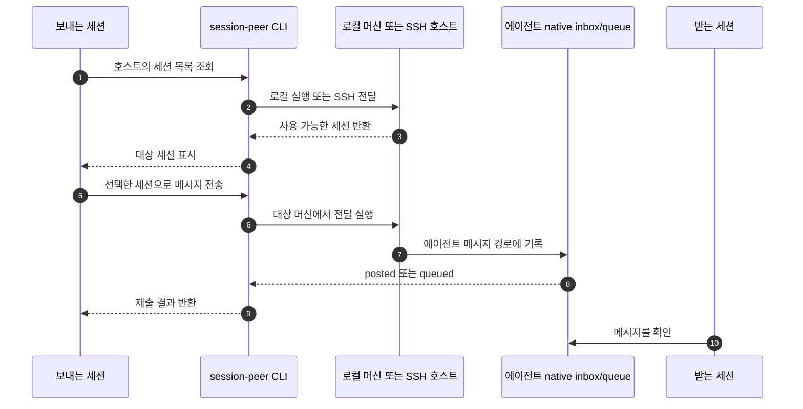

## 먼저 다뤘던 건 Claude Code의 SSH 인박스였다

요즘은 Codex가 만든 변경을 다른 머신의 Claude Code에 맡겨 검토받고, 답을 원래 세션으로 돌리는 식으로 쓴다. 터미널 사이에서 내용을 복사하는 대신, 실제 세션을 찾아 각 앱이 원래 쓰는 인박스나 큐로 요청을 전달하는 흐름이다. Claude Code 세션에 SSH로 메시지를 보내던 방식과 그때 부딪힌 문제는 [앞선 글](https://blog.abruption.dev/posts/claude-code-cross-machine-session-messaging-over-ssh/)에 따로 적어뒀다.

session-peer는 새 에이전트 조직이나 중앙 대화 서비스를 만드는 도구가 아니다. 이미 실행 중인 Claude Code와 Codex 세션을 찾아, 로컬 또는 SSH로 메시지를 전달하고 답을 주고받게 하는 CLI다. 그래서 먼저 풀어야 할 문제는 “메시지를 어디에 쓸까?”보다 “지금 응답할 수 있는 정확한 세션이 어느 호스트에 있나?”였다.

## 먼저 세션을 찾고, 그다음 보낸다

기본 흐름은 두 명령으로 나뉜다.

```bash
session-peer list --host worker
session-peer send --host worker --to api-worker --message "이 변경을 리뷰하고 위험한 부분을 알려줘." --dry-run
session-peer send --host worker --to api-worker --message "이 변경을 리뷰하고 위험한 부분을 알려줘."
```

`api-worker`는 예시다. 먼저 목록에서 실제 대상 세션을 확인하고, `--dry-run`으로 선택된 호스트와 대상을 확인한 뒤 보내는 식이다. Codex는 서로 다른 `CODEX_HOME`에 같은 thread UUID가 있을 수 있다. 그래서 UUID만 보고 목적지를 고르지 않고, host/home과 실제 writer 증거를 다시 확인한다. 어디서 쓰는 세션인지 모호하면 하나를 임의로 택하는 대신 거부한다. 이 구분은 v1.0.1에서 특히 중요해졌다.

로컬 세션과 SSH 호스트의 세션은 같은 CLI로 다루지만, 원격 머신의 터미널에 키 입력을 흉내 내지는 않는다. Claude Code는 native inbox/socket, Codex는 native queue를 사용한다. Codex 대화 DB는 세션을 찾기 위해 읽을 뿐, 그 안에 대화를 직접 써넣지 않는다.



받는 머신에 `session-peer`를 별도로 설치하지 않아도 기본 목록 조회와 전송은 가능하다. SSH 대상에 Python, 해당 에이전트, 수신함이나 큐가 있고 필요한 권한이 갖춰져야 한다. 세션을 찾는 에이전트별 어댑터와, 로컬/SSH 실행 경로를 나눠 둔 이유도 여기에 있다. 에이전트가 달라도 전달 방식이 같다고 가정하지 않으면서, CLI 사용법은 공통으로 유지할 수 있다.

## 터미널에 직접 입력하지 않는 이유

`tmux send-keys`처럼 터미널에 텍스트를 입력하는 방법도 있지만, 그 순간 포커스된 프로그램에 따라 메시지가 엉뚱한 곳으로 들어갈 수 있다. native inbox나 queue를 쓰면 요청은 에이전트가 제공하는 메시지 경로에 남고, 받는 쪽의 설정과 권한도 그대로 유지된다. 메시지는 권한이 아니다. `session-peer`가 권한 프롬프트를 대신 승인하거나 보안 설정을 바꾸지는 않는다.

Codex 세션을 깨우는 동작도 기본 전송에 넣지 않았다. 메시지 전달과 새 작업을 강제로 시작하는 건 다른 일이기 때문이다. 비활성 세션을 깨우는 기능은 사용자가 따로 선택해야 하고, 그 선택은 실제로 새 작업과 사용량을 발생시킬 수 있다.

세션을 찾아 메시지를 넣는 공통 경로는 만들었다. 그런데 인박스에 `posted` 또는 `queued`가 찍혀도 상대가 읽었다는 뜻은 아니다. 다음 단계에서는 이 전송 결과와 실제 답장을 어떻게 구분했는지 살펴본다.

## 더 보기

- [session-peer 저장소](https://github.com/abruption/session-peer)
- [v1.0.1 릴리스와 변경 사항](https://github.com/abruption/session-peer/blob/v1.0.1/docs/releases/v1.0.1.md)
- [Claude Code 세션에 SSH로 메시지 보내기](https://blog.abruption.dev/posts/claude-code-cross-machine-session-messaging-over-ssh/)
