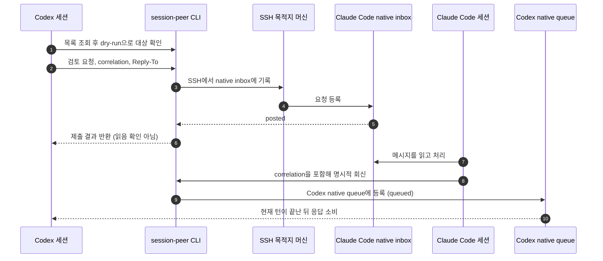

## `posted`는 답장이 아니다

앞 편에서는 `session-peer`가 호스트와 세션을 찾고, 메시지를 Claude Code의 인박스나 Codex의 큐에 넣는 흐름을 다뤘다. 쓰다 보니 전송 결과에서 같은 질문이 남았다. `posted`라고 나왔으면 상대가 읽은 걸까?

아니다. 그 표시는 메시지가 인박스에 제출됐다는 뜻이지, 상대 세션이 확인하거나 일을 끝냈다는 뜻이 아니다. 이 둘을 한 상태처럼 다루면 보낸 쪽은 결과를 확인하지 못한 채 성공이라고 믿게 된다.

답이 필요한 로컬/SSH 요청에는 회신 주소를 함께 붙인다. 받는 세션이 그 주소를 따라 응답을 보내면, 답장은 처음 요청을 보낸 세션의 인박스나 큐로 돌아온다. 이 예시는 local/SSH 전송에 한정된다. MCP와 paired 전송에는 자동 Reply-To가 없어서 같은 회신 흐름이라고 보면 안 된다.

보냈다는 확인과 답장을 따로 둔 건 작은 차이 같지만, 자동화에서는 꽤 중요하다. 전자는 전달 경로가 요청을 받아들였다는 뜻이고, 후자는 받는 세션이 실제로 응답을 보냈다는 증거다.

SSH 연결이 성공했다고 반대 방향 회신 경로까지 보장되는 건 아니다. 답장이 중요한 요청이라면 보내기 전에 return-route도 확인해야 한다. 그리고 Codex가 바쁜 상태라면 큐의 답은 현재 턴이 끝난 다음 읽힐 수 있다. 답이 바로 안 온다고 같은 요청을 재전송하면 중복 작업이 생길 수 있다. 제출 후 결과가 불명확한 메시지는 자동으로 다시 보내지 않는 이유다.

## 화면에서 확인하는 실제 왕복

README에는 Codex 세션이 Claude Code 세션을 찾아 코드 리뷰를 부탁하고 답장을 받는 26초짜리 GIF가 있다. 샘플 출력을 이어 붙인 영상이 아니라 실제 로컬 세션 사이의 왕복을 녹화한 것이다. SSH나 Relay 전송 시연은 아니므로, 그 경로의 증거처럼 소개하면 안 된다.

마지막에 답장이 돌아오는 장면이 핵심이다. 전송 명령이 성공했다는 표시만으로는 상대 세션이 메시지를 읽었다고 할 수 없다. 그래서 `session-peer`는 답이 필요한 상황에서 응답 경로를 명시적으로 연결한다.

## 안정판을 내고도 남은 일

2026년 9월 24일에 첫 안정판 `v1.0.0`을 공개했다. 이 릴리스는 RC4에서 검증한 런타임을 첫 안정판으로 올린 것으로, 로컬·SSH 코어는 외부 Python 패키지 없이 동작한다. paired/Relay, MCP, Antigravity 연결은 각각 선택 기능으로 분리했다. 패키지를 설치했다고 호스팅 Relay나 OAuth 서비스가 따라오는 것도 아니다.

릴리스 검증도 성공 숫자 하나로 뭉개지 않았다. 4시간 넘게 진행한 `rc4-rerun-02`에서 제출은 21건 모두 성공했지만 exact ACK는 20/21이었다. Windows Claude TUI가 종료돼 해당 경로의 ACK를 확인하지 못했다. 같은 경로로 새 one-shot 확인은 성공했지만, 그 결과를 원래 집계에 더해 21/21로 고치지는 않았다. 제출 성공과 실제 응답을 따로 세는 게 맞기 때문이다.

다음 날인 9월 25일에는 `v1.0.1`을 냈다. 그 사이 확인한 문제 중 하나는 네트워크가 아니었다. macOS의 launchd 서비스는 대화형 터미널과 PATH가 달라 Codex 실행 파일을 찾지 못할 수 있었다. `v1.0.1`은 macOS/Linux Relay receiver에서 실행 파일을 명시할 수 있게 하고, native 전달 전에 실패한 경우를 `refused`로 분류한다. 글을 쓰는 9월 27일 기준 공개 Latest는 `v1.0.1`이다. 따라서 이 변경을 첫 안정판 `v1.0.0`에 있었던 기능처럼 설명하지 않았다.

반대로 아직 원인을 모르는 문제도 남아 있다. Cloudflare와 한국 Relay 사이의 간헐적인 정체는 원인과 책임 경로가 확인되지 않았다. 재접속 진단이 좋아졌다고 네트워크 문제를 해결했다고 말할 수는 없다. 이 이슈는 `v1.0.1`에서도 모니터링 중이다.

처음부터 완성된 제품을 설계한 건 아니지만, 지금은 적어도 지키고 싶은 기준이 분명하다. 인박스에 제출한 사실은 읽음 확인이 아니고, 답장이 없다고 모르는 결과를 자동 재전송하지 않는다. 어떤 전송 경로를 택했는지, 실제 ACK를 받았는지도 각각 따로 확인한다.

## 더 보기

- [session-peer 저장소](https://github.com/abruption/session-peer)
- [v1.0.0 릴리스](https://github.com/abruption/session-peer/releases/tag/v1.0.0)
- [v1.0.0 공개 검증과 한계](https://github.com/abruption/session-peer/blob/v1.0.0/docs/releases/v1.0.0.md)
- [v1.0.1 릴리스와 변경 사항](https://github.com/abruption/session-peer/releases/tag/v1.0.1)
- [v1.0.1 PyPI 패키지](https://pypi.org/project/session-peer/1.0.1/)
- [진행 중인 Relay 이슈 #161](https://github.com/abruption/session-peer/issues/161)
- [프로젝트 소개와 문서](https://abruption.dev/projects/session-peer/)
